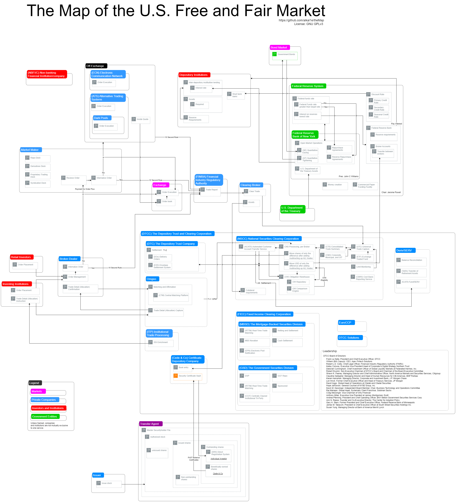

# The Map of the U.S. Free and Fair Market

  

## Project philosophy
- The map is to be neutral and objective

## Dependencies
Uses diagrams.net [https://github.com/jgraph]

## Support
If you found this helpful you can give me a thanks, but information should always be free.

0x8e87dAf9e8754F74256A4b06B4694Ea0bC79154e

## License
GNU GPLv3 
https://choosealicense.com/licenses/gpl-3.0/
